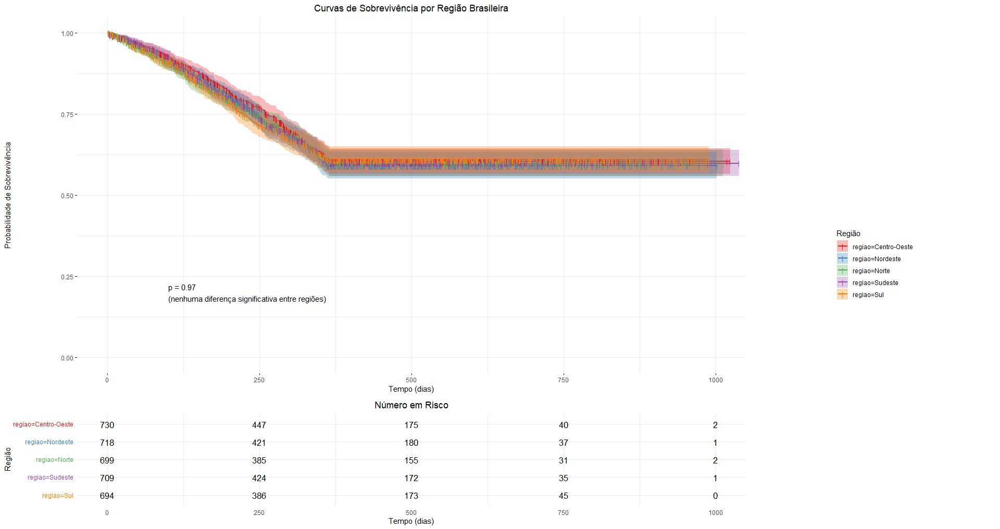
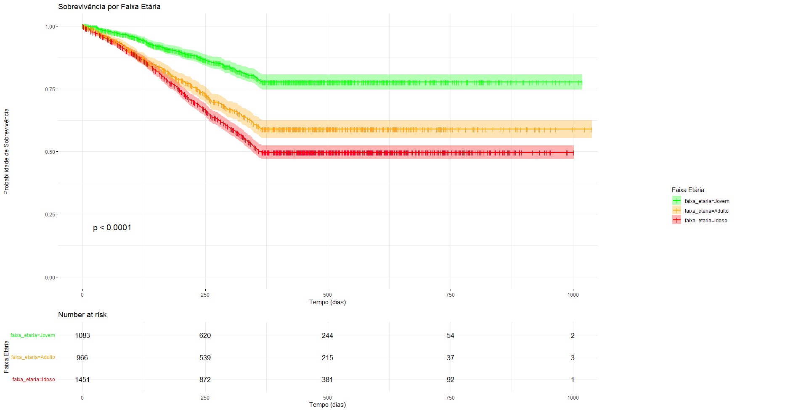
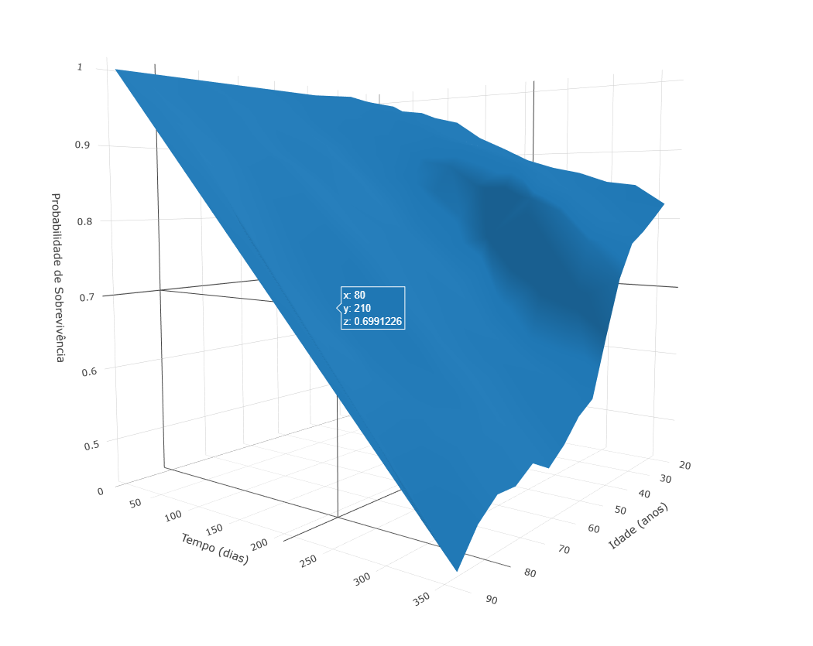

# 🧬 rwe-survival  
### Análise de Sobrevivência com Dados do SUS — Real-World Evidence Brasileira  

[](https://www.r-project.org/)
[](LICENSE)
[](https://rstudio.com/)

> **Evidência do mundo real para políticas de saúde pública no Brasil**  
> Um projeto *open-source* para análise de sobrevida usando dados simulados (prontos para substituição por dados reais do DATASUS), com foco em **disparidades regionais e demográficas**.

---

## 🎯 Objetivo

Desenvolver uma **análise completa de sobrevivência** com:

- ✅ Modelos de Kaplan-Meier por **região geográfica**  
- ✅ Estratificação por **faixa etária** (Jovem / Adulto / Idoso)  
- ✅ Visualizações 2D profissionais (`ggsurvplot`) + **superfície 3D interativa** (`plotly`)  
- ✅ Código modular, reprodutível e documentado  

👉 **Diferencial**: Enquanto muitos projetos usam dados clínicos ideais, este explora cenários realistas — com censura, variação demográfica e estrutura do SUS — preparando o caminho para análise com dados reais.

---

## 📊 Principais Resultados

| Análise | Gráfico | Insight |
|--------|---------|---------|
| **Sobrevivência por região** |  | Curvas sobrepostas (p = 0.97) → sem diferença significativa entre regiões *(como esperado na simulação)* |
| **Sobrevivência por idade** |  | **Idosos têm menor sobrevida** — fator crítico para políticas públicas |
| **Superfície 3D: idade × tempo × sobrevivência** |  | Queda acentuada nos primeiros 250 dias, especialmente em idosos |

> 💡 *Todos os gráficos são interativos em `plotly` ou prontos para exportação em alta resolução.*

---

## 🧪 Tecnologias Utilizadas

| Categoria | Pacotes |
|---------|---------|
| **Modelagem** | `survival`, `broom` |
| **Manipulação** | `dplyr`, `lubridate` |
| **Visualização 2D** | `ggplot2`, `survminer` |
| **Visualização 3D** | `plotly` |
| **Relatórios** | `rmarkdown` (pronto para integração) |

### 1. Clone o repositório
```bash
git clone https://github.com/seu-usuario/rwe-survival.git
